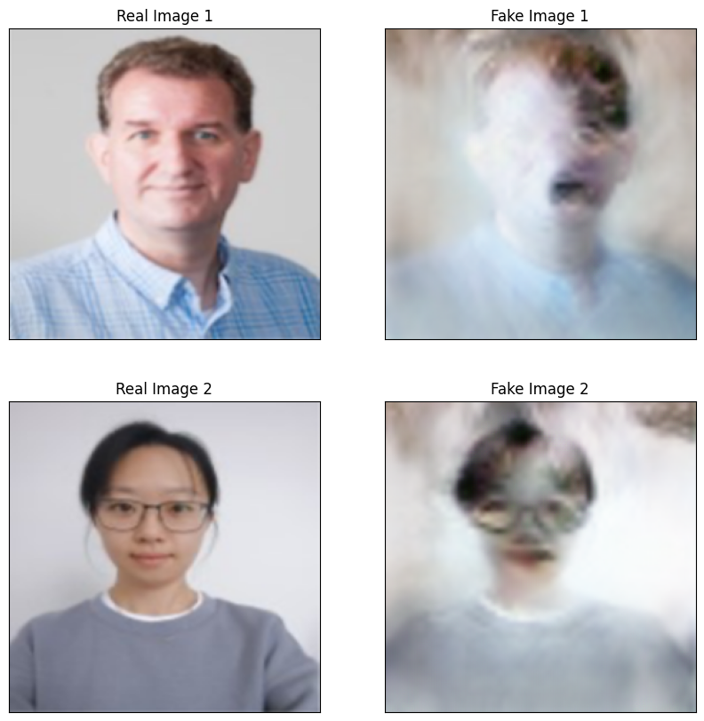

# CycleGAN Implementation for Image Transformation

This repository contains a detailed implementation of a CycleGAN model for unpaired image-to-image translation. The project transforms images between two domains: humans and cats/dogs.

## Key Steps and Features

### 1. Dataset Preparation
- **Google Drive Integration**: Accessed the dataset saved on Google Drive.
- **Dataset Structure**:
  - `trainA`: Images of humans.
  - `trainB`: Images of cats and dogs.
  - `testA`: Human images for testing.
  - `testB`: Cat/dog images for testing.

### 2. Setting Up the Model
- **Cloned CycleGAN Repository**: Used the official [PyTorch CycleGAN repository](https://github.com/junyanz/pytorch-CycleGAN-and-pix2pix).
- **Dependency Installation**: Installed all necessary libraries for error-free execution.
- **Dataset Link Creation**: Created a symbolic link to the dataset for seamless integration.

### 3. Training the Model
- **Training Parameters**:
  - Model: `cycle_gan` (not pretrained).
  - Epochs: 25 with 5 epochs for decay.
  - Batch size: Increased to 4 (default is 1).
- **Training Command**:
  ```bash
  python train.py --dataroot ./dataset --name part_1 --model cycle_gan --n_epochs 25 --n_epochs_decay 5 --batch_size 4 --display_id -1

### 4.Image Preprocessing
- Resized images to a uniform size (64x64) to ensure compatibility during testing.
- Preprocessing script utilized the Python PIL library to resize images.

### 5. Testing the Model

#### Testing Commands:
- **Human to Cat/Dog Transformation**:
  - Rename `latest_net_G_A.pth` to `latest_net_G.pth`.
  - Use the `--direction AtoB` parameter.
  - Input images from `testA_resized`.

- **Cat/Dog to Human Transformation**:
  - Rename `latest_net_G_B.pth` to `latest_net_G.pth`.
  - Use the `--direction BtoA` parameter.
  - Input images from `testB_resized`.

### 6. Visualizing Results

- **Visualization Process**:
  - Display real images and their transformed counterparts side by side.
  - Results are stored in the `/content/pytorch-CycleGAN-and-pix2pix/results/part_1/test_latest/images` directory.

### 7. Results

